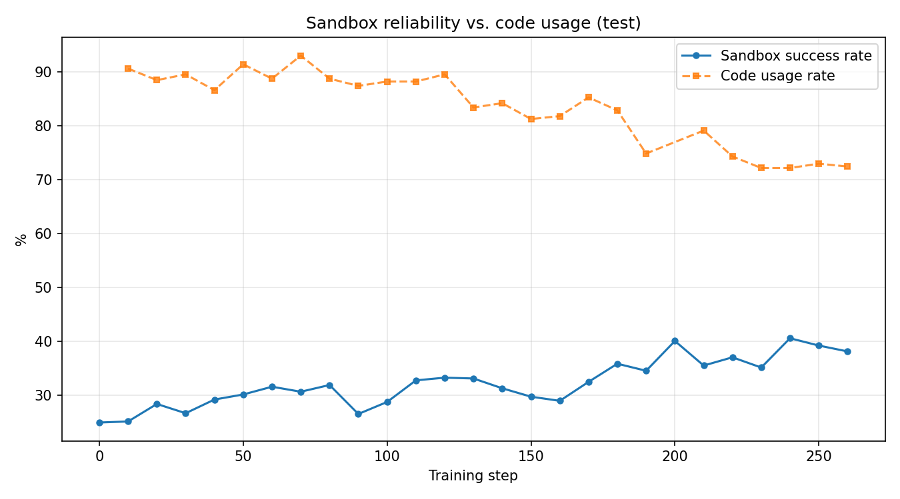

# ToRL-Reproduction

Reproduction and training-dynamics analysis of **ToRL: Scaling Tool-Integrated RL** ([arXiv:2503.23383](https://arxiv.org/abs/2503.23383)) on a **2-GPU** AutoDL instance.

ToRL trains LLMs to use Python code execution as an external tool during mathematical reasoning, starting directly from a base model without SFT. This repository reproduces the ToRL / verl training pipeline with **Qwen2.5-Math-7B-Base** under a severe compute constraint (2 GPUs instead of the usual 8), analyzes training dynamics and tool-usage behavior from rollout samples, and documents the engineering issues encountered.

> **Key outcome:** post-hoc analysis of 291 rollout sample files (~97k sandbox executions) revealed that the code-execution sandbox was **never actually reachable** — the sandbox URL in the upstream code is an unconfigured placeholder. This run is therefore equivalent to the paper's **RL-without-tool baseline**, which the measured numbers independently confirm. See [Tool Usage Analysis](#tool-usage-analysis).

---

## Results

Training-time validation accuracy, produced automatically by the ToRL training pipeline (`test_freq=10`).

> **Note:** These are **training-time validation** results, not a separate post-hoc merged-checkpoint evaluation.
> Benchmark sizes in this validation set: **MATH500 subset n=134**, **AIME24 n=30**, **AIME25 n=30**.
> With n=30, a single problem is worth 3.3pp — AIME numbers are reported for completeness only and step-to-step variation is within noise.

### Validation Accuracy

| Step | AIME24 (n=30) | MATH500 (n=134) | AIME25 (n=30) | Average |
|---:|---:|---:|---:|---:|
| 0 | 10.0% | 48.5% | 3.3% | 20.6% |
| 100 | 13.3% | 51.5% | 10.0% | 24.9% |
| 140 | 16.7% | 57.5% | 16.7% | 30.3% |
| 160 | **30.0%** | 56.7% | 16.7% | **34.5%** |
| 200 | 26.7% | **59.0%** | 13.3% | 33.0% |
| 220 | **30.0%** | 53.7% | **18.3%** | 34.0% |
| 250 | 20.0% | 53.7% | 12.5% | 28.7% |
| 260 | 23.3% | 50.7% | 16.7% | 30.2% |


### Key Findings

- **MATH500 (n=134) improved from 48.5% → 59.0%** (step 0 → 200), the most statistically meaningful signal here.
- Best average validation accuracy was **34.5% at step 160**, earlier than the latest saved checkpoint (`global_step_250`) — longer RL training did not monotonically improve performance, motivating explicit checkpoint selection.
- **AIME24 peaked at 30.0%.** As shown below, this closely matches the paper's *RL-without-tool* baseline rather than full ToRL — because the tool channel was never connected.

---

## Tool Usage Analysis

The paper's headline analytical claim is **code usage evolution**: as training progresses, the proportion of problems solved using code *increases steadily*. This reproduction measured the opposite, which led to a root-cause investigation.

**Method:** parsed all 291 rollout sample files under `output_torl/samples/{train,test}/step_*.json` (n=374 responses/step for test, n=256 for train), extracted ```` ```python ```` / ```` ```output ```` blocks, and classified every sandbox return value.

### Code usage declines instead of rising

| Split | First step | Last step | Δ |
|---|---:|---:|---:|
| train | 84.0% (step 1) | 78.1% (step 264) | −5.9pp |
| **test** | **90.6% (step 10)** | **72.5% (step 260)** | **−18.2pp** |

Average code blocks per response also declined (test: 1.61 → 1.16).

For reference, comparable work all reports the opposite direction: ToRL's own final code usage is ~83%, [ReTool](https://arxiv.org/abs/2504.11536) rises to ~98%, and [CoRT](https://arxiv.org/abs/2506.09820) rises from 86% to >95%. **This run starts at 90.6% — above ToRL's endpoint — and falls.**



### Sandbox execution outcomes (~97k executions)

| Outcome | Count | Share |
|---|---:|---:|
| `UnknownError` | 59,594 | **61.7%** |
| OK | 32,314 | 33.5% |
| Other errors | 4,097 | 4.2% |
| Timeout | 567 | 0.6% |

Genuine Python tracebacks account for only 4.2% — real syntax/runtime errors should dominate the error bucket, not a single opaque string.

Sandbox "success rate" *rises* over training (24.9% → 38.1%) while code usage *falls*, giving a **strong negative correlation (r = −0.784, n=25)**.

### Root cause

`verl/workers/rollout/vllm_rollout/vllm_rollout_spmd.py`:

```python
# line 107-113 — the sandbox endpoint is a placeholder, never configured
def send_request(json_data):
    try:
        url = 'sandbox_url'                       # <-- literal placeholder, no scheme
        response = requests.post(url, json=json_data, timeout=10)
        return response.json()
    except:                                        # <-- bare except swallows MissingSchema
        print("sanbox timeout")                    # <-- misreports every failure as timeout
        return {"error": "unknown"}

# line ~222 — timeout fallback dict has no 'return_code' key
except:
    results[index] = {"run_result": {"stdout": "Error", "stderr": "TimeoutError"}}

# line ~226-234 — postproc reads 'return_code' -> KeyError -> everything becomes UnknownError
def postproc(output):
    try:
        if str(output['run_result']['return_code']) == '0' or ...
    except Exception:
        return "Error", "UnknownError"
```

Three failures compound: an **unconfigured placeholder URL** means `requests.post('sandbox_url', ...)` raises `MissingSchema` immediately; a **bare `except`** swallows it and returns a dict without `run_result`; `postproc` then raises `KeyError` and collapses every distinct failure into the same information-free string.

This silently disables ToRL's design intent. The config sets `execution_error_penalty: False` specifically so that *execution errors are returned to the model as a learning signal* — but the model only ever received `UnknownError`.

### Consistency check

With `C=1`, only the **first** code block per response is actually executed; any further ```` ```output ```` blocks are **hallucinated by the model**. Expected real-execution share = code_rate (~85%) × C=1 ÷ avg output blocks (1.34) ≈ **63.4%**, versus the measured 61.7% `UnknownError`. The match implies **real sandbox calls failed ~100% of the time**, and the 33.5% "OK" bucket consists of model-fabricated tool output.

### Implication

This run is equivalent to the paper's **RL-without-tool baseline**:

| | AIME24 |
|---|---:|
| This reproduction (best, step 160/220) | **30.0%** |
| Paper's RL-without-tool baseline (derived: 43.3% − 14pp) | **≈29.3%** |
| Paper's full ToRL-7B | **43.3%** |

The measured 30.0% lands almost exactly on the paper's no-tool baseline. This is a **positive result for pipeline correctness** — FSDP, vLLM rollout, GRPO, and reward verification all behaved as intended — and it attributes the 13.3pp gap to the missing tool channel, matching the paper's claimed ~14pp tool gain.

> The ≈29.3% baseline figure is *derived* from the paper's statement that ToRL-7B surpasses RL without tool integration by 14pp; it is not quoted directly.

---

## Environment

| Component | Version |
|---|---|
| GPU | 2× NVIDIA H800 80GB |
| Base model | Qwen2.5-Math-7B-Base (7.62B) |
| Training framework | ToRL / verl |
| Training strategy | Full-parameter FSDP + vLLM rollout |
| Algorithm | GRPO |
| PyTorch | 2.6.0+cu124 (CUDA runtime 12.4) |
| vLLM | 0.8.1 |
| Ray | 2.44.0 |
| Transformers | 4.50.0 |
| Flash Attention | 2.7.4.post1, **built from source** |
| Precision | bfloat16 |

> The AutoDL driver reports CUDA 13.0 capability, but PyTorch uses CUDA runtime 12.4.

---

## Training Configuration

Fitting **full-parameter** RL training of a 7.62B model onto 2 GPUs required aggressive memory offloading.

| Parameter | Value |
|---|---|
| Algorithm | GRPO (`adv_estimator: grpo`) |
| Training method | Full-parameter FSDP |
| **FSDP param offload** | **True** |
| **FSDP optimizer offload** | **True** |
| **Gradient checkpointing** | **True** |
| Rollout engine | vLLM |
| Tensor parallel size | 2 |
| Train batch size | 32 prompts |
| Samples per prompt (K) | 8 |
| **Tool calls per response (C)** | **1** (`num_llm_calls_available`) |
| **Prompt template** | **`tir_base_0309`** (TIR) |
| **Execution error penalty** | **False** (errors returned to model, not penalized) |
| Reward | **±1** verifiable reward (Python sandbox + math-verify) |
| Max prompt length | 400 |
| Max response length | 2048 |
| Learning rate | 1e-6, `warmup_style: constant` (no decay by design) |
| KL coefficient | 0.0 |
| PPO mini batch size | 256 |
| PPO max token length per GPU | 8192 |
| GPU memory utilization (vLLM) | 0.5 |
| Rollout temperature | 1.0 |
| Measured MFU | **~20%** |
| Dataset | 28,740 → **28,680** after filtering |
| Save frequency | every 50 steps |
| Validation frequency | every 10 steps |
| Latest saved checkpoint | `global_step_250` |
| Final observed step | 264 |

**No SFT cold start** — training runs directly from the base model, matching ToRL's core design.

---

## Training Dynamics

Per-step metrics for steps 201–264 (the resumed segment retained in `logs/torl_train.log`):

| Metric | Behavior |
|---|---|
| `actor/entropy_loss` | 0.200 → 0.209 — **flat**, no entropy collapse |
| `actor/grad_norm` | ~0.017, stable |
| `critic/score/mean` | −0.248 avg (≈37.6% training accuracy under ±1 reward) |
| `response_length/mean` | ~1000–1160 tokens |
| `response_length/clip_ratio` | 5–11% of responses hit the 2048-token cap |
| `actor/pg_clipfrac` | 0.000 (expected: `ppo_epochs=1`, fully on-policy) |

Training had **plateaued** in this window — entropy and gradient norms are stable, and validation fluctuates without trend. The earlier improvement (steps 0–200) is real; the later variation is not evidence of over-optimization, but it does show the best checkpoint precedes the final one, which is why checkpoint selection matters.

---

## How to Reproduce

### 1. Clone ToRL and download the base model

```bash
git clone https://github.com/GAIR-NLP/ToRL
cd ToRL
# Download Qwen2.5-Math-7B-Base to your local model directory
```

### 2. Install key dependencies

```bash
pip install "qwen-agent[python_executor]"
pip install math-verify
pip install accelerate
```

Flash Attention was built from source to match the local PyTorch / CUDA / ABI environment:

```bash
export CUDA_HOME=/root/miniconda3
export LD_LIBRARY_PATH=/root/miniconda3/lib:/root/miniconda3/lib64:$LD_LIBRARY_PATH
export CPATH=/root/miniconda3/include:$CPATH
export TORCH_CUDA_ARCH_LIST="9.0"
export FLASH_ATTENTION_FORCE_BUILD=TRUE
MAX_JOBS=2 pip install -v flash-attn==2.7.4.post1 \
  --no-build-isolation --no-cache-dir --no-binary flash-attn
```

### 3. Configure the sandbox endpoint

> **Important — this step is not documented upstream and its omission silently invalidates the entire tool channel.**
> Edit `verl/workers/rollout/vllm_rollout/vllm_rollout_spmd.py:109` and replace the `'sandbox_url'` placeholder with a real endpoint that accepts `{'code': str, 'language': 'python'}` and returns `{'run_result': {'stdout': ..., 'stderr': ..., 'return_code': ...}}`.

### 4. Set environment variables

```bash
export VLLM_USE_V1=0
export NCCL_CUMEM_ENABLE=0
export LD_LIBRARY_PATH=/root/miniconda3/lib/python3.12/site-packages/torch/lib:$LD_LIBRARY_PATH
```

### 5. Run training

```bash
cd scripts
bash torl_7b_2gpu.sh
```

### 6. Reproduce the tool-usage analysis

```bash
python analysis/analyze_tool_usage.py    # code usage rate per step
python analysis/analyze_sandbox.py       # sandbox outcome classification + correlation
```

---

## Engineering Notes

| Issue | Fix / Explanation |
|---|---|
| Flash Attention binary ABI mismatch (`undefined symbol: flash_attn_2_cuda`) | Wheels tagged `abiFALSE` still failed against `torch 2.6.0+cu124` (`_GLIBCXX_USE_CXX11_ABI=False`). Rebuilt `flash-attn==2.7.4.post1` from source. |
| `fatal error: nv/target: No such file or directory` during build | `CUDA_HOME` / `CONDA_PREFIX` / `cuda-cccl` include paths not exported. Fixed via `CPATH` / `CPLUS_INCLUDE_PATH`. |
| `libc10.so not found` | Added PyTorch lib path to `LD_LIBRARY_PATH`. |
| `ModuleNotFoundError: accelerate` | Required for FSDP init; `pip install -U accelerate`. |
| **Sandbox returns `UnknownError` for 61.7% of executions** | **Placeholder URL at `vllm_rollout_spmd.py:109` + bare `except` + timeout fallback dict missing `return_code` → `KeyError` in `postproc`. All distinct failures collapse into one opaque string, disabling ToRL's error-as-learning-signal design. See [Tool Usage Analysis](#tool-usage-analysis).** |
| Fitting 7.62B full-parameter RL on 2 GPUs | FSDP `param_offload=True` + `optimizer_offload=True` + gradient checkpointing + `gpu_memory_utilization=0.5` for vLLM. Measured MFU ~20%. |
| `trainer.total_epochs=250` | Yields `total_training_steps=224000` — training never terminates on its own. Note `warmup_style: constant` means the LR is constant by design, so this does **not** affect the LR schedule. |
| Ray / NCCL / FSDP `state_dict_type` warnings | Non-fatal; verified after model and rollout engine loaded successfully. |
| Training terminated at step 264 | Killed by the system OOM killer. Checkpoints and validation results up to step 260 were preserved. |

---

## Limitations

Stated explicitly, as they bound what can be concluded from this reproduction:

1. **The tool channel was never active.** The sandbox endpoint was an unconfigured placeholder, so this run is equivalent to the paper's RL-without-tool baseline. The paper's central claim — that tool integration improves mathematical reasoning — is **not** verified here; it is instead *indirectly corroborated* by the 13.3pp gap matching the paper's stated ~14pp tool gain.
2. **No no-tool control group was run.** Since the tool channel was inactive throughout, no within-experiment ablation exists. Comparison is against the paper's reported numbers only.
3. **MATH500 here is a 134-problem subset**, not the full 500-problem benchmark. AIME24/AIME25 are n=30 each — a single problem is worth 3.3pp, so step-to-step AIME variation is within noise.
4. **Logs for steps 0–200 were not preserved.** `logs/torl_train.log` covers the resumed segment (steps 201–264) only. Validation numbers for earlier steps are transcribed from the original run.
5. **No standalone post-hoc evaluation.** Checkpoints remain in FSDP-sharded format; all reported numbers come from training-time validation. These are suitable for reproduction and dynamics analysis but should not be cited as official benchmark results.
6. **Training stopped at step 264**, far short of the paper's schedule.

---

## Project Structure

```text
ToRL-Reproduction/
├── README.md
├── scripts/
│   └── torl_7b_2gpu.sh
├── docs/
│   ├── troubleshooting.md
│   └── environment.md
├── analysis/
│   ├── analyze_tool_usage.py
│   ├── analyze_sandbox.py
│   ├── torl_validation_accuracy_curve.png
│   ├── torl_validation_accuracy_curve.svg
│   ├── tool_usage_curve.png
│   └── sandbox_vs_code.png
├── results/
│   ├── torl_validation_summary.csv
│   ├── torl_validation_best_metrics.csv
│   ├── tool_usage_by_step.csv
│   └── sandbox_by_step.csv
└── logs/
    └── torl_train.log
```

Model weights, checkpoints, and `.safetensors` / `.pt` files are **not** committed.

---

## Citation

```bibtex
@misc{li2025torlscalingtoolintegratedrl,
  title={ToRL: Scaling Tool-Integrated RL},
  author={Xuefeng Li and Haoyang Zou and Pengfei Liu},
  year={2025},
  eprint={2503.23383},
  archivePrefix={arXiv}
}
```

---

## Acknowledgements

Based on the official [GAIR-NLP/ToRL](https://github.com/GAIR-NLP/ToRL) repository.
