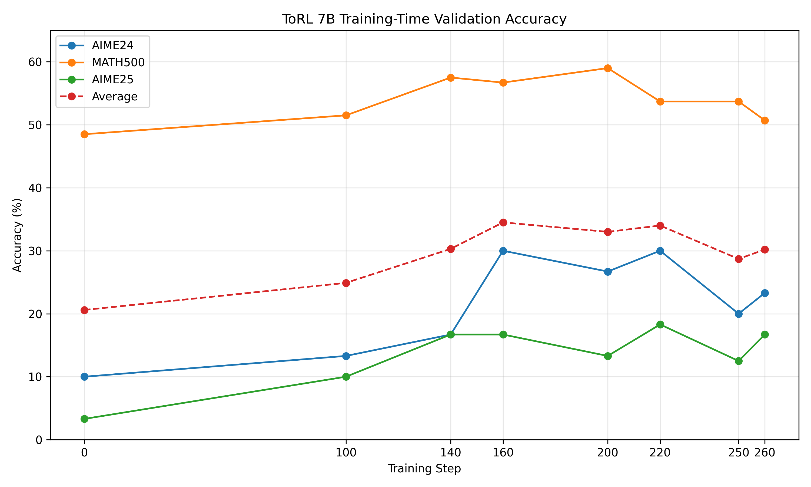

# ToRL-Reproduction

Reproduction and training dynamics analysis of **ToRL: Scaling Tool-Integrated RL** on a 2-GPU AutoDL instance.

ToRL trains large language models to use Python code execution as an external tool during mathematical reasoning. This reproduction focuses on running the ToRL / verl training pipeline with **Qwen2.5-Math-7B-Base**, analyzing training-time validation behavior, and documenting practical engineering issues encountered during reproduction.

---

## Results

We report training-time validation accuracy from the ToRL training pipeline. Validation was automatically performed during training using the same sandbox-based Python execution and math-verification scoring setup.

> Note: These are training-time validation results, not a separate post-hoc merged-checkpoint evaluation.

### Validation Accuracy

| Step | AIME24 | MATH500 | AIME25 | Average |
|---:|---:|---:|---:|---:|
| 0 | 10.0% | 48.5% | 3.3% | 20.6% |
| 100 | 13.3% | 51.5% | 10.0% | 24.9% |
| 140 | 16.7% | 57.5% | 16.7% | 30.3% |
| 160 | **30.0%** | 56.7% | 16.7% | **34.5%** |
| 200 | 26.7% | **59.0%** | 13.3% | 33.0% |
| 220 | **30.0%** | 53.7% | **18.3%** | 34.0% |
| 250 | 20.0% | 53.7% | 12.5% | 28.7% |
| 260 | 23.3% | 50.7% | 16.7% | 30.2% |



### Key Findings

- MATH500 improved from **48.5%** at step 0 to **59.0%** at step 200.
- AIME24 improved from **10.0%** at step 0 to **30.0%** at step 160/220.
- AIME25 improved from **3.3%** at step 0 to **18.3%** at step 220.
- The best average validation accuracy was **34.5%** at step 160.
- The latest saved checkpoint is `global_step_250`, while the best validation performance appeared earlier. This shows that longer RL training did not monotonically improve all benchmarks.

---

## Environment

The experiment was reproduced on a 2-GPU AutoDL instance.

| Component | Version |
|---|---|
| GPU | 2× NVIDIA H800/A800 80GB |
| Base model | Qwen2.5-Math-7B-Base |
| Training framework | ToRL / verl |
| Training strategy | Full-parameter FSDP + vLLM rollout |
| PyTorch | 2.6.0+cu124 |
| PyTorch CUDA runtime | 12.4 |
| vLLM | 0.8.1 |
| Ray | 2.44.0 |
| Flash Attention | 2.7.4.post1, built from source |
| Transformers | 4.50.0 |
| Precision | bfloat16 |

---

## Training Configuration

| Parameter | Value |
|---|---|
| Base model | Qwen2.5-Math-7B-Base |
| Algorithm | GRPO |
| Training method | Full-parameter FSDP |
| Rollout engine | vLLM |
| Tensor parallel size | 2 |
| Train batch size | 32 prompts |
| Samples per prompt | 8 |
| Max prompt length | 400 |
| Max response length | 2048 |
| Learning rate | 1e-6 |
| KL coefficient | 0.0 |
| PPO mini batch size | 256 |
| PPO max token length per GPU | 8192 |
| GPU memory utilization | 0.5 |
| Latest saved checkpoint | global_step_250 |
| Final observed step | 260 |

---

## Training Dynamics

The validation curve shows that ToRL improves mathematical reasoning performance during early GRPO training, but performance is not monotonic across all benchmarks.


The strongest improvements appear between step 100 and step 220. MATH500 peaks at step 200, while AIME24 and AIME25 peak at step 160/220. After step 220, the average validation score drops slightly, suggesting possible instability or over-optimization under the current small-scale 2-GPU setting.

---

## How to Reproduce

### 1. Clone ToRL and download the base model

```bash
git clone https://github.com/GAIR-NLP/ToRL
cd ToRL
# Download Qwen2.5-Math-7B-Base to your local model directory
2. Install key dependencies
pip install "qwen-agent[python_executor]"
pip install math-verify
pip install accelerate

Flash Attention was built from source to match the local PyTorch / CUDA / ABI environment.

3. Set environment variables
export VLLM_USE_V1=0
export NCCL_CUMEM_ENABLE=0
export LD_LIBRARY_PATH=/root/miniconda3/lib/python3.12/site-packages/torch/lib:/root/miniconda3/lib:/root/miniconda3/lib64:$LD_LIBRARY_PATH
4. Run training
cd scripts
bash torl_7b_2gpu.sh
Engineering Notes

Running ToRL on a 2-GPU AutoDL instance required several practical fixes:

IssueFix
Flash Attention binary ABI mismatchRebuilt flash-attn==2.7.4.post1 from source
Missing accelerate dependencyInstalled accelerate for FSDP initialization
libc10.so not foundAdded PyTorch library path to LD_LIBRARY_PATH
vLLM / Ray initialization warningsVerified non-fatal after model and rollout engine loaded successfully
Long training scheduleStopped after obtaining checkpoints and validation results up to step 260
Project Structure
ToRL-Reproduction/
├── README.md
├── scripts/
│   └── torl_7b_2gpu.sh
├── docs/
│   ├── troubleshooting.md
│   └── environment.md
├── analysis/
│   ├── torl_validation_accuracy_curve.png
│   └── torl_validation_accuracy_curve.svg
├── results/
│   ├── torl_validation_summary.csv
│   └── torl_validation_best_metrics.csv
└── logs/
    └── torl_train.log
Notes

This reproduction focuses on running and analyzing the ToRL training pipeline rather than releasing a final merged HuggingFace checkpoint.

The original training checkpoint is stored in FSDP-sharded format. Since the original repository does not provide a standalone evaluation script, this report uses the validation results automatically produced during training. These results are suitable for reproduction analysis and training-dynamics discussion, but should not be described as an official final benchmark.

Citation
@misc{li2025torlscalingtoolintegratedrl,
  title={ToRL: Scaling Tool-Integrated RL},
  author={Xuefeng Li and Haoyang Zou and Pengfei Liu},
  year={2025},
  eprint={2503.23383},
  archivePrefix={arXiv}
}
Acknowledgements

This project is based on the official GAIR-NLP/ToRL repository.
